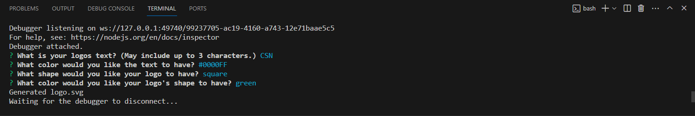

# Logo Generator

## Description

In this logo generator you can choose three characters and their colors as well as the background shape and color. After you enter the information you can open the logo.svf file in browser to see your new logo.

## Installation

You must have Node.js and install the dependencies. (Use 'npm i' to automatically install the dependencies with Node.js.)

## Usage

First open a terminal in the logo-maker folder and then run 'npm i' to install the dependencies. After the dependencies are installed run 'node index.js' and the prompt will pop-up in the terminal. Follow the prompts until it says 'Generated logo.svg'. Then all that is left is to open your logo.svg file in browser and your logo will be shown to you!

## Credits

[Inquirer](https://www.npmjs.com/package/inquirer) was used for the prompts.
